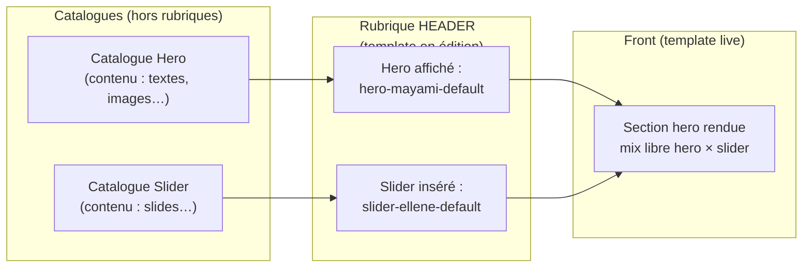

# EM-WP — V2 Templates

> **Branche :** `feature/em-wp-v2-templates`  
> **V1 (gelée) :** `feature/theme-em-wp`  
> **Dernière maj doc :** 2026-06-14 (fin de session — implémentation V2 quasi terminée)  
> **Statut global :** Phases **0–5 ✅** (implémentation livrée et poussée) ; Phase **6 🔄** — QA Tyson + checklist finale

Ce fichier est le **doc de suivi unique** V2. Le mettre à jour **à chaque phase / commit significatif** (statuts, fichiers créés, dette restante).

---

## Prompt reprise (copier-coller en début de session)

```text
Contexte em-wp V2 — Phase 6 (QA + validation finale).

Branche : feature/em-wp-v2-templates
Dernier commit poussé : 5fb63ec — feat(dashboard): carte Nouveau Template alignée sommaire
Doc suivi : em-wp/documentation/TEMPLATE_V2.md
Spec wizard : em-wp/documentation/WIZARD-NEW-TEMPLATE.md
Local : http://localhost:8190/wp-admin (Docker em-wp-local)

Implémentation V2 livrée (Phases 0–5, poussé) :
- Templates : sommaire cartes + onglets colorés, pastilles LIVE/ACTIVER, tableau CRUD inline
- Wizard 2 étapes (Identité + Plan interactif) + modales vierge/duplication
- Accueil : carte Nouveau Template = sommaire (DUPLIQUER • WIZARD + modales)
- Squelette rubriques par template, CONTACT, hub catalogues custom, renderer mutualisé
- Modale couleur partagée, rename inline sommaire catalogues, chrome ellene-admin

Reste Phase 6 :
- Checklist QA BACK/FRONT (tableaux ci-dessous) — Tyson
- Validation finale « OK V2 » → dernier Flow GH doc si besoin
- Dette optionnelle : hero/slider settings.php, variant-hub, legacy visibility global

Commencer par : lire ce doc + git status ; priorité = tests Tyson ou corrections signalées.
```

---

## Workflow par phase (validé)

À **chaque phase terminée** côté implémentation :

1. **Agent** — livre la phase + liste explicite des **tests BACK / FRONT** à exécuter.
2. **Tyson** — valide ou signale les corrections (pas de Flow GH tant que non validé).
3. **Si validé** — agent lance **Flow GH** (commits atomiques proposés → exécution après accord) + **push** sur `feature/em-wp-v2-templates`.
4. **Ensuite** — enchaînement phase suivante (ex. Phase 0 → 1 → 2…).

| Étape | Qui | Action |
|-------|-----|--------|
| Implémentation | Agent | Code + maj `TEMPLATE_V2.md` (statut phase, journal) |
| Tests | Tyson | BACK (admin WP) + FRONT (landing) selon checklist fournie |
| Validation | Tyson | « OK phase N » ou retours |
| Git | Agent | Flow GH + push branche dédiée **uniquement si validé** |
| Suite | Agent | Phase N+1 |

**Branche unique V2 :** `feature/em-wp-v2-templates` — pas de merge V1/V2 sans accord explicite.

---

## Suivi en temps réel

### Légende

| Symbole | Signification |
|---------|----------------|
| ⬜ | À faire |
| 🔄 | En cours |
| ✅ | Terminé |
| ⏸ | Bloqué / en attente décision |

### Phases

| Phase | Objectif | Statut | Commit(s) | Notes |
|-------|----------|--------|-----------|-------|
| **0** | Fondations template (core + bandeau + page Templates) | ✅ | c737936 + couleurs | Validée — couleur/template, menu teinté, bandeau blocs blancs |
| **1** | STREAM par template | ✅ | 589b3cb | Validée — options par template, migration Mayami, module découpé |
| **2** | VIDEOS + RELEASES par template | ✅ | 99d9b71 | |
| **3** | TOP-BAR, SOCIAL, CTA, FOOTER par template | ✅ | 4ca7251 | |
| **4** | HEADER + Catalogues Hero/Slider + sélection par template | ✅ | 64b0ea0 + lots intermédiaires | Hub catalogues, CRUD heros/sliders, HEADER live — dette hero/slider settings |
| **5** | Sommaire + squelette + CONTACT + Wizard + polish admin | ✅ | f8b6be8 → 5fb63ec | Wizard, modales création, sommaire/table CRUD, pastilles LIVE, Accueil aligné — **validation Tyson QA** |
| **6** | Migration Mayami + tests front + clôture V2 | 🔄 | — | Checklist QA ci-dessous |

### Dette V1 à traiter pendant V2 (fichiers > 350 lignes)

| Fichier | Lignes | Action prévue | Statut |
|---------|--------|---------------|--------|
| `inc/admin/modules/slider/settings.php` | ~640 | Découper (voir arborescence) | 🔄 Phase 4 |
| `inc/admin/modules/hero/settings.php` | ~632 | Découper (voir arborescence) | 🔄 Phase 4 |
| `inc/admin/pages/rubriques.php` | ~448 | Extraire rendu / helpers | ⬜ |
| `inc/admin/shared/style-panel.php` | ~406 | OK proche limite ; pas d’ajout massif | ⬜ |
| `inc/admin/shared/menu.php` | ~720 | Extraire bandeau template → module dédié ; dette accrue Phase 4 | 🔄 |
| `inc/admin/shared/hub-cards.php` | ~1240 | Extraire pastilles template / cartes create | 🔄 Phase 5 |
| `inc/admin/shared/variant-hub.php` | ~396 | Remplacer progressivement par template-hub | ⬜ |
| `inc/shared/rubrique-order.php` | ~309 | Ajouter visibilité template sans gonfler | ⬜ |

### Journal (dernières entrées)

| Date | Auteur | Entrée |
|------|--------|--------|
| 2026-06-14 | Agent | Doc : Phases 0–5 ✅ implémentation ; Phase 6 QA — dernier push 5fb63ec |
| 2026-06-14 | Agent | Flow GH session polish : modale couleur, LIVE/ACTIVER, wizard/modales, chrome ellene-admin, Accueil Nouveau Template (2972260 → 5fb63ec) |
| 2026-06-14 | Agent | Wizard V1 : page dédiée, 2 étapes Identité + Plan interactif, brouillon (9370271 → b1a0d24) |
| 2026-06-14 | Agent | Sommaire Templates : cartes colorées, tableau enregistrés CRUD inline, modales vierge/duplication (3eaaf3d → 769c4d0) |
| 2026-06-14 | Tyson | Pause — **Wizard demain soir** |
| 2026-06-14 | Agent | Flow GH soir : fix menu CONTACT (cce73f7), Accueil Nouveau … (e2c4c5a), doc (21fbde7) |
| 2026-06-14 | Agent | Flow GH : 5 commits CONTACT + squelette (56f47cb → f8b6be8) |
| 2026-06-14 | Agent | CONTACT : catalogue custom, rubrique template, front #contact, labels éditables Label/Valeur |
| 2026-06-14 | Agent | Squelette template : insertion positionnée, couleurs, masquée par défaut, UI panneau + |
| 2026-06-14 | Agent | Mutualisation panneau catalogue Release/Stream/Contact (`catalog-rubrique-page.php`) |
| 2026-06-14 | Agent | Hub catalogues custom : CRUD modules, slugs, renommage, entrées Mayami/Ellene |
| 2026-06-14 | Agent | Bandeau pastille édition/live, modale confirmation hub, fil d'Ariane squelette |
| 2026-06-13 | Tyson | Pause soir — remarques/corrections à venir sur Phase 4 WIP ; reprise demain |
| 2026-06-13 | Agent | Flow GH : commit 64b0ea0 Phase 4 WIP (HEADER, catalogues, menu admin, front) — non validé |
| 2026-06-13 | Agent | Menu admin : bloc Paramètres, purge séparateurs WP natifs (filet uniforme em-wp) |
| 2026-06-13 | Agent | Phase 4 en cours : rubrique HEADER, catalogues Heros/Sliders, migration V1, plan du site encadrant HEADER, front landing-render |
| 2026-06-13 | Tyson | Modèle Phase 4 : rubrique **HEADER** (pas HEROS/SLIDERS séparés) ; menu **Catalogues** > Heros + Sliders ; swap layout interne HEADER |
| 2026-06-13 | Tyson | Menu Phase 4 : SECTION HERO (rubrique) + catalogues à part ; SLIDERS hors rubriques ; 1 hero/template V2 |
| 2026-06-13 | Tyson | Modèle Hero/Slider validé : catalogue global, édition indépendante, sélection par template, mix hero×slider libre ; GH Phase 2+3 avant Phase 4 |
| 2026-06-13 | Agent | Phase 3 TOP-BAR, SOCIAL, CTA, FOOTER par template + visibilité indépendante |
| 2026-06-13 | Tyson | Go Phase 3 |
| 2026-06-13 | Tyson | Go Phase 2 |
| 2026-06-13 | Agent | Phase 1 STREAM : options par template, migration Mayami, découpage admin module |
| 2026-06-13 | Tyson | Go Phase 1 |
| 2026-06-13 | Agent | Couleur par template, menu admin teinté, bandeau UX (blocs blancs, alerte, Save) |
| 2026-06-13 | Tyson | Phase 0 validée — Flow GH + push, pause avant Phase 1 |
| 2026-06-13 | Agent | Phase 0 : bandeau compact, ellene-admin CRUD templates, titres rubriques dynamiques |
| 2026-06-13 | — | Workflow par phase validé : tests BACK/FRONT → validation Tyson → Flow GH + push → phase suivante |

---

## Récap commits Phase 5 (session 14/06, poussés)

| Commit | Sujet |
|--------|--------|
| `9370271` | Wizard : page dédiée, Identité + Plan interactif |
| `3eaaf3d` | Sommaire Mes Templates : cartes, onglets, badges LIVE/ACTIVER |
| `769c4d0` | Tableau templates enregistrés — CRUD inline, suppression |
| `b7f78ec` | Modales nouveau template (vierge / duplication) + backend duplicate |
| `2972260` | Modale couleur partagée |
| `e43411f` | Pastilles LIVE/ACTIVER unifiées (bandeau, sommaire, dashboard, menu) |
| `abc7e5d` | Toasts auto-dismiss 3 s |
| `62104ed` | Menu latéral : fond sélection item actif |
| `771b7ed` | Rename inline sommaire catalogues |
| `14cf9fd` | Libellés rubriques + pages catalogue mutualisées |
| `776ab0f` | Chrome admin + restrictions ellene-admin |
| `b1a0d24` | Wizard/modales — entrées vierge vs duplication |
| `5fb63ec` | Accueil : carte Nouveau Template = sommaire |

---

## Objectif

Plusieurs **Templates** (noms éditables) portent **tout le contenu** des rubriques. Un seul template **actif sur le site**. Le bandeau **Template en édition** filtre tout l’admin (Option A).

---

## Décisions validées

| Sujet | Décision |
|-------|----------|
| Entité | **Template** |
| Contenu | Toutes rubriques personnalisables par template |
| Structure site | **Globale** (liste rubriques, ordre, plan) |
| Visibilité | **Par template** (œil Afficher/Masquer) |
| Nouvelle rubrique (ex. Contact) | Globale ; masquée par template si besoin ; **CONTACT livré** (catalogue custom + rubrique squelette) |
| Menu admin | Option A : rubriques + bandeau sélecteur visible |
| Template live vs édition | 2 contextes distincts (bandeau vs page Templates) |
| Priorité multi-template | STREAM → VIDEOS → RELEASES → reste |
| Hero / Slider | **Catalogue global** réutilisable ; **1 hero + 1 slider par template** (V2) |
| Édition Hero / Slider | **Catalogues à part** — contenu éditable sans lien au bandeau template |
| Rattachement hero + slider | Rubrique **HEADER** (template en édition) : choix hero catalogue + slider catalogue + layout |
| Menu rubriques | **HEADER** remplace HEROS/SLIDERS ; sliders retirés des rubriques |
| Catalogues admin | **Catalogues → Heros / Sliders** — menus hors rubriques (CRUD contenu, sans bandeau template) |
| Hero × Slider | **Découplés dans le catalogue** ; **associés** au moment du choix dans SECTION HERO (mix libre) |
| Création Hero / Slider | Dupliquer + renommer immédiat **ou** modèle vierge — **nommage obligatoire en premier** |
| Slugs initiaux (migration) | `hero-mayami-default`, `hero-ellene-default`, `slider-mayami-default`, `slider-ellene-default` (ajustables plus tard) |
| Rotation / playlist hero | **Hors scope V2** — plusieurs heros qui tournent par intervalle → phase ultérieure |

---

## Conventions code (obligatoires V2)

### Taille des fichiers

- **Maximum ~350 lignes** par fichier PHP (hors commentaires/docblocks).
- Au-delà : **découper immédiatement**, pas « on refactorera plus tard ».
- Un fichier = **une responsabilité** (register, render, sanitize, migration, ajax…).

### Séparation des responsabilités

| Couche | Rôle | Exemple |
|--------|------|---------|
| `inc/shared/` | Logique métier, options WP, résolution front/admin | `template-registry.php` |
| `inc/admin/` | UI, menus, assets admin, saves | `pages/templates.php` |
| `inc/front/` | Rendu landing uniquement | `modules/stream/render.php` |
| `inc/admin/modules/{rubrique}/` | Config **d’une** rubrique | `defaults.php`, `sanitize.php` |

**Interdit :** mélanger register menu + render HTML + sanitize + migration dans un seul `settings.php` monolithique.

### Nommage

- Options : `em_wp_{rubrique}_{template_slug}_options`
- Fonctions : préfixe `em_wp_` + domaine clair (`em_wp_template_*`, `em_wp_stream_*`)
- Fichiers : kebab ou segment métier explicite (`option-names.php`, `admin-page.php`)

### Bootstrap

- Chaque dossier `inc/.../template/` expose un `bootstrap.php` qui `require_once` les fichiers du module (ordre fixe).
- `inc/admin/bootstrap.php` ne fait qu’inclure les bootstraps modules — pas de logique métier.

### Réutilisation V1

- Réutiliser `style-panel.php`, `settings-api.php`, assets admin partagés.
- **Ne pas** étendre `variant-hub.php` pour les templates : créer `template-hub.php` dédié si besoin.
- Migrer Hero/Slider vers le modèle template sans dupliquer l’UI existante.

---

## Arborescence cible V2

Objectif : un dev ouvre `inc/shared/template/` ou `inc/admin/template/` et sait où ajouter une feature.

```
em-wp/wp/wp-content/themes/em-wp/
├── inc/
│   ├── shared/
│   │   ├── template/                    # Cœur métier Templates
│   │   │   ├── bootstrap.php
│   │   │   ├── registry.php             # définitions, liste templates
│   │   │   ├── active.php               # slug live + editing (admin)
│   │   │   ├── visibility.php           # visibilité par template × rubrique
│   │   │   ├── option-names.php         # em_wp_*_options helpers
│   │   │   ├── resolve-options.php      # get options for front / admin
│   │   │   └── migrate-v1.php           # migration Mayami (Phase 6)
│   │   ├── rubrique-order.php           # ordre global (inchangé)
│   │   └── ...
│   ├── admin/
│   │   ├── template/                    # UI Templates transverse
│   │   │   ├── bootstrap.php
│   │   │   ├── banner.php               # bandeau sélecteur (toutes pages em-wp)
│   │   │   ├── pages/
│   │   │   │   ├── list.php             # sommaire + tableau CRUD
│   │   │   │   ├── create-page.php      # hub brouillons + workspace wizard
│   │   │   │   └── new-template-modals.php
│   │   │   ├── wizard/                  # wizard 2 étapes (Identité + Plan)
│   │   │   │   ├── config-data.php
│   │   │   │   ├── render-wizard-ui.php
│   │   │   │   └── bootstrap.php
│   │   │   ├── ajax/
│   │   │   │   └── save-editing.php
│   │   │   └── register-saves.php       # handlers save template / live / wizard
│   │   ├── modules/
│   │   │   ├── stream/
│   │   │   │   ├── bootstrap.php
│   │   │   │   ├── defaults.php
│   │   │   │   ├── sanitize.php
│   │   │   │   ├── get-options.php
│   │   │   │   ├── register.php         # menu + settings API
│   │   │   │   └── admin-page.php       # rendu HTML (< 350 L)
│   │   │   ├── hero/                    # refactor V1 → même découpe
│   │   │   │   ├── bootstrap.php
│   │   │   │   ├── defaults.php
│   │   │   │   ├── sanitize.php
│   │   │   │   ├── register.php
│   │   │   │   ├── admin-page.php
│   │   │   │   └── partials/            # mayami layout, items list…
│   │   │   └── …                        # idem slider, video, release, etc.
│   │   └── pages/
│   │       └── rubriques.php            # allégé ; visibilité → template
│   └── front/
│       ├── template-context.php         # résolution template live (thin)
│       └── modules/{rubrique}/
│           └── render.php               # lit resolve-options template live
├── assets/admin/css/template/           # bandeau, page liste templates
└── documentation/
    └── TEMPLATE_V2.md                   # ce fichier
```

### Règles arborescence

1. **Nouvelle feature template** → d’abord `inc/shared/template/`, puis admin UI, puis front.
2. **Nouvelle rubrique** → dossier `inc/admin/modules/{slug}/` + `inc/front/modules/{slug}/` ; enregistrement dans `registry` template + rubrique-order global.
3. **Pas de fichiers à la racine `inc/`** sauf loaders existants (`functions.php` pattern).
4. **Partials admin** dans `partials/` si le rendu d’une page dépasse ~200 lignes.

---

## Modèle de données

| Option | Rôle |
|--------|------|
| `em_wp_template_definitions` | Templates (slug, label, métadonnées) |
| `em_wp_active_template` | Template **live** front |
| `em_wp_template_visibility` | `{ template => { rubrique => bool } }` |
| `em_wp_site_rubrique_order` | Ordre global (inchangé) |
| `em_wp_{rubrique}_{template}_options` | Contenu par rubrique × template (sauf hero/slider — voir ci-dessous) |
| `em_wp_hero_catalog` | Registre des heros (slug, label, layout, métadonnées) |
| `em_wp_slider_catalog` | Registre des sliders (slug, label, layout, métadonnées) |
| `em_wp_hero_{slug}_options` | Contenu d’**un** hero du catalogue |
| `em_wp_slider_{slug}_options` | Contenu d’**un** slider du catalogue |
| `em_wp_header_{template}_options` | Sélection HEADER par template : `{ hero_slug, slider_slug, layout, enabled }` |

**V1 encore en place (Phase 4 à migrer) :** `em_wp_hero_active_style`, `em_wp_slider_active_style`, slugs hardcodés `mayami` / `ellene`.

### API shared (à implémenter Phase 0)

```php
em_wp_template_registry()                    // liste templates
em_wp_get_active_template_slug()             // front live
em_wp_get_editing_template_slug()            // admin bandeau
em_wp_template_option_name($rubrique, $slug)
em_wp_get_template_rubrique_options($rubrique, $template_slug)
em_wp_is_template_rubrique_visible($template_slug, $rubrique_slug)
```

---

## UX rappel

- **Bandeau** : Template en édition + indicateur Live ; warning si édition ≠ live.
- **Menu rubriques** : raccourcis vers contenu **filtré par template du bandeau** (STREAM, HEADER, …).
- **Page Templates** : seul endroit pour « Actif sur le site » + CRUD templates.

### Menu admin — état actuel vs cible Phase 4

```text
AUJOURD’HUI (V1 + Phases 0–3)          CIBLE PHASE 4
─────────────────────────────          ─────────────────────────────────

Rubriques                              Rubriques (bandeau = édition)
├── TOP-BAR                            ├── TOP-BAR
├── HEROS          ← confus            ├── HEADER          ← choix hero + slider catalogue
├── SLIDERS        ← rubrique séparée  ├── STREAM
├── STREAM                             ├── SOCIAL
├── …                                  ├── …

HEROS = hub variantes + radio global   (HEROS / SLIDERS disparaissent des rubriques)

                                       Catalogues (menu séparé)
                                       ├── Heros    ← CRUD contenu
                                       └── Sliders  ← CRUD contenu
```



**HEADER** ne modifie pas le contenu des catalogues : il **pointe** vers une entrée hero + une entrée slider pour le template en cours d’édition. Le plan du site affiche un encadrant HEADER ; le swap gauche/droite enregistre le layout interne (`hero_left` / `slider_left`).

---

## Plan d’implémentation (détail par phase)

### Phase 0 — Fondations
- [x] `inc/shared/template/*` (registry, active, option-names, resolve, visibility)
- [x] `inc/admin/template/*` (banner, page list, saves)
- [x] Intégration bootstrap admin + enqueue CSS bandeau
- [x] Template `mayami` par défaut en registry (sans migration options yet)
- [x] **Maj ce doc** : Phase 0 → ✅

### Phase 1 — STREAM
- [x] Découper `stream/settings.php` → structure module/
- [x] Options `em_wp_stream_{template}_options`
- [x] Admin lit/écrit template **en édition** (bandeau) ; front via `resolve-options` + template **live**
- [x] Migration idempotente `em_wp_stream_options` → `em_wp_stream_mayami_options` (legacy conservé)
- [x] `settings-api.php` : support `value_field` pour POST fixe / option dynamique
- [x] **Maj ce doc** : Phase 1 → ✅

### Phase 2 — VIDEOS + RELEASES
- [x] VIDEO : structure module/ (`defaults`, `get-options`, `sanitize`, `migrate`, `partials`, `admin-page`, `register`)
- [x] RELEASE : idem + `normalize-rows` + partials lignes
- [x] Options `em_wp_video_{template}_options` et `em_wp_release_{template}_options`
- [x] Admin template en édition ; front via `get_options_for_front` + template live
- [x] Migration idempotente legacy → Mayami (options conservées)
- [x] Visibilité **indépendante par template** (stream, video, release) — plus de sync global `em_wp_site_rubrique_visibility`
- [x] **Maj ce doc** (statut ✅ — Flow GH)

### Phase 3 — TOP-BAR, SOCIAL, CTA, FOOTER
- [x] TOP-BAR : structure module/ découpée (< 350 L/fichier)
- [x] SOCIAL, CTA, FOOTER : même pattern V2
- [x] Options `em_wp_{rubrique}_{template}_options` pour les 4 rubriques
- [x] Admin template en édition ; front via `get_options_for_front`
- [x] Migration idempotente legacy → Mayami
- [x] Visibilité indépendante par template (étendue aux 7 rubriques V2)
- [x] **Maj ce doc** (statut ✅ — Flow GH)

**HEADER** ne modifie pas le contenu des catalogues : il **pointe** vers une entrée hero + une entrée slider pour le template en cours d’édition. Le **Plan du site** affiche un encadrant HEADER avec sous-blocs Hero / Slider ; le bouton swap inverse le layout interne (`hero_left` / `slider_left`), pas l’ordre global des rubriques.

### Phase 4 — HEADER + Catalogues Hero/Slider

**Prérequis :** Phases 2 et 3 poussées sur `feature/em-wp-v2-templates`.

#### Principe

```text
Catalogue Hero          Catalogue Slider
(contenu indépendant)   (contenu indépendant)
        │                       │
        └───────────┬───────────┘
                    │
            Rubrique HEADER
            (template en édition via bandeau)
              · hero_slug choisi
              · slider_slug choisi
              · layout hero_left | slider_left
              · visibilité rubrique (enabled)
                    │
                    └── front live : template actif → em_wp_render_header()
```

**Cas d’usage validé :** template Ellene live + hero `hero-mayami-default` + slider `slider-ellene-default`.

**V2 :** 1 hero + 1 slider par template. Rotation / playlist → **hors scope**.

#### Admin UX cible

| Zone | Comportement |
|------|--------------|
| Menu **Catalogues → Heros** | Hub CRUD : liste, éditer contenu existant |
| Menu **Catalogues → Sliders** | Idem sliders |
| Rubrique **HEADER** | Pour le **template en édition** : sélecteurs hero + slider ; layout ; visibilité |
| Sommaire / Plan du site | Une ligne **HEADER** ; encadrant avec sous-zones Hero / Slider ; swap = layout |
| Badge « Actif » global V1 | Supprimé (save handlers retirés) |

#### Tâches techniques

- [x] Menus : HEADER + Catalogues Heros/Sliders + bloc Paramètres (Appearance, Settings, Plugins TAD only)
- [x] `inc/shared/catalog/` : registry, option-names, migrate-v1, resolve-style
- [x] Options `em_wp_header_{template}_options`
- [x] Migration V1 → slugs catalogue + ordre rubrique `header`
- [x] Front : `em_wp_render_header()` + landing-render sans paire hero/slider
- [x] Plan du site : encadrant HEADER + AJAX layout swap
- [x] Enqueue CSS hero/slider depuis config HEADER live
- [x] Bandeau template masqué sur écrans catalogues (`em_wp_admin_is_catalog_screen`)
- [x] Menu : séparateurs em-wp uniformes, purge `separator-last` / WP natifs
- [ ] **Revue Tyson** — remarques et corrections sur l'existant (priorité reprise)
- [x] CRUD templates : créer (wizard/duplication), renommer inline, supprimer
- [ ] CRUD catalogue hero/slider complet (créer, dupliquer, supprimer) — partiellement livré
- [ ] Suppression complète options V1 `em_wp_hero_active_style` / UI radio
- [ ] Découper `hero/settings.php` et `slider/settings.php`
- [ ] Tests BACK/FRONT checklist ci-dessous
- [ ] **Maj ce doc** → ✅ après validation Tyson globale

### Phase 5 — Sommaire
- [x] Squelette rubriques **par template** : ordre persisté, AJAX add/remove/reorder
- [x] Panneau « + » : rubriques proposables, position d'insertion, couleurs initiales, masquée par défaut
- [x] Visibilité par template (œil sommaire + options rubrique)
- [x] Module **CONTACT** : catalogue custom (`contacts`), rubrique `em-wp-contacts`, front `#contact`
- [x] Hub catalogues : modules custom CRUD + renderer mutualisé Release/Stream/Contact
- [x] Menu latéral : rubriques hors contexte masquées (pas d'intrus CONTACT sur dashboard)
- [x] Accueil : cartes « Nouveau Catalogue » / « Nouveau Template » → deeplink création
- [x] **Wizard onboarding** — 2 étapes (Identité + Plan interactif) — spec : [WIZARD-NEW-TEMPLATE.md](./WIZARD-NEW-TEMPLATE.md)
- [x] Modales « Nouveau template » : vierge (wizard) / duplication (hub + sommaire + Accueil)
- [x] Sommaire Templates : cartes par template, onglets colorés, pastilles LIVE/ACTIVER unifiées
- [x] Tableau templates enregistrés : édition inline (nom, couleur), suppression confirmée
- [x] Accueil : carte « Nouveau Template » identique au sommaire (DUPLIQUER • WIZARD)
- [x] Modale couleur partagée (aperçu texte sur fond réel)
- [x] Hub catalogues : rename inline sommaire, libellés COULEURS/Importer, pages catalogue mutualisées
- [x] Chrome admin : Visit site prod, Apparence FR, restrictions compte `ellene-admin`
- [x] Toasts auto-dismiss 3 s ; menu latéral fond sélection item actif
- [ ] Retrait `em_wp_site_rubrique_visibility` global legacy (si encore utilisé)
- [ ] Tests BACK/FRONT checklist Phase 5 + Phase 6
- [ ] **Validation Tyson « OK V2 »** → clôture doc

### Phase 6 — Migration & QA
- [ ] Revue Tyson globale BACK (admin em-wp complet)
- [ ] Revue Tyson globale FRONT (landing, templates Mayami/Ellene)
- [ ] Script migrate-v1.php idempotent (si pas déjà couvert par migrations par rubrique)
- [ ] Checklist manuelle (tableaux ci-dessous)
- [ ] **Maj ce doc** → statut global Terminé

### Checklist QA Phase 5 (avant clôture V2)

| Test | OK |
|------|-----|
| Sommaire Templates : cartes colorées, pastille LIVE sur template actif | ⬜ |
| Sommaire : pastille ACTIVER sur templates non live | ⬜ |
| Carte « Nouveau template » : + ouvre modale ; DUPLIQUER / WIZARD fonctionnels | ⬜ |
| Accueil : carte Nouveau Template identique au sommaire (modales + pastille) | ⬜ |
| Wizard : création vierge (Identité → Plan → submit) | ⬜ |
| Wizard : duplication template existant | ⬜ |
| Tableau templates : rename inline, couleur, suppression | ⬜ |
| Squelette : add/remove/reorder rubriques par template | ⬜ |
| Modale couleur : aperçu texte sur fond sélectionné | ⬜ |
| Compte ellene-admin : restrictions profil / apparence / Ctrl+K | ⬜ |
| Toasts admin : auto-dismiss ~3 s | ⬜ |

### Checklist QA Phase 4 (avant validation)

| Test | OK |
|------|-----|
| Menu : filets uniformes (pas de `li.wp-menu-separator` WP natif) | ⬜ |
| Menu : Catalogues > Heros / Sliders sans bandeau template | ⬜ |
| Menu : HEADER dans Rubriques ; Paramètres après Templates | ⬜ |
| Rubrique HEADER : sélection hero + slider pour template en édition | ⬜ |
| Plan du site : encadrant HEADER, swap layout hero/slider | ⬜ |
| Front live : section HEADER rend hero + slider du template actif | ⬜ |
| Mix catalogue : template Ellene + hero Mayami + slider Ellene | ⬜ |
| Éditer un hero catalogue sans changer le bandeau template | ⬜ |
| Migration V1 idempotente (`wp eval 'em_wp_catalog_maybe_migrate_v1();'`) | ⬜ |

### Checklist QA finale (Phase 6)

| Test | OK |
|------|-----|
| Changer template live → hero, slider, stream, top-bar cohérents | ⬜ |
| Template Ellene live + hero Mayami catalogue → promo sans duplication | ⬜ |
| Éditer un hero sans changer le bandeau template | ⬜ |
| Bandeau : éditer B while live A → pas de confusion | ⬜ |
| Masquer STREAM sur template X → absent front | ⬜ |
| Sommaire œil = visibilité template en édition | ⬜ |
| Aucun fichier PHP nouveau > 350 lignes | ⬜ |

---

## Git

| Branche | Rôle |
|---------|------|
| `feature/theme-em-wp` | V1 |
| `feature/em-wp-v2-templates` | V2 (courante) |

- Commits atomiques par phase ou sous-lot logique.
- Push après « Flow GH » + validation.
- Pas de PR.

---

## Hors scope V2

- Ordre des sections par template (squelette **par template** livré ; ordre global inchangé)
- ~~Rubrique Contact~~ → **livré Phase 5** (module catalogue `contacts`)
- ~~Wizard onboarding~~ → **livré Phase 5** (2 étapes + modales vierge/duplication)
- Layouts hero/slider multiples par entité (un layout type « default » suffit en V2 ; renommage slug ajustable)
- **Playlist hero** : plusieurs heros affichés en rotation / par intervalle (1 hero par template en V2)

---

## Références V1 utiles

| Fichier | Usage |
|---------|--------|
| `inc/shared/rubrique-order.php` | Ordre global |
| `inc/admin/pages/rubriques.php` | Sommaire |
| `inc/admin/shared/style-panel.php` | Panneaux accordion |
| `inc/admin/shared/settings-api.php` | Saves admin.php |
| `inc/admin/modules/hero/settings.php` | UI à decouper, pas à copier tel quel |
